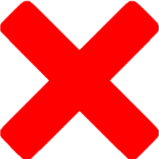

# Lazarus

Lazarus is a C++, bitboard-based chess engine with neural network and other cool stuff.

The origin of the name comes from the history of the project's creation and the multiple, deep refactorings it has experienced.

## In development
Unfortunately, this is not a final version of the project. 
Despite completing most of the key stages and bringing the project to a usable state, there are still some significant improvements and functionalities missing, without which the project cannot be considered ready.
For this reason, the engine is not yet ready for final testing and measurement of its playing strength.

Among the milestones already completed, the most important ones can be highlighted:
- Board and pieces representation&nbsp; 
- Sliding piece attacks, magic bitboards&nbsp; 
- Full game rules implementation - enpassant, pins, checks and promotions&nbsp; 
- Move generation algorithms&nbsp; 
- Transposition table&nbsp; 
- Basic search&nbsp; 
- Quiescence search&nbsp; 
- Selectivity heuristics&nbsp; 
- Neural network model (NNUE) implementation and training&nbsp; 

The most important missing functionalities are:
- Multi-threaded search&nbsp; 
- Opening book & endgame tablebase connection&nbsp; 
- Time management&nbsp; 
- UCI and connection with custom GUI&nbsp; 

## Build and run
To build and run the project, you need to have CMake and a C++ compiler installed. The project supports two build modes:

1. **CLI (Command-Line Interface)**: The engine runs in the terminal without a GUI.
2. **GUI (Graphical User Interface)**: The engine is linked with SFML and includes a graphical interface (requires the `USE_GUI` flag).

Additionally, you can enable **development mode** with the `DEV` flag, which includes tests for internal validation.

### Prerequisites

- **CMake** version 3.10 or higher
- **C++20** compiler (e.g., GCC, Clang, MSVC)
- **SFML 2.5.1** (only for GUI mode)

### Build Steps

#### 1. Clone the repository
If you haven't cloned the repository yet, you can do so using:

```bash
git clone https://github.com/IgorSwat/Lazarus.git
cd Lazarus
```

#### 2. Create the build directory
Create a build directory where the project will be compiled:

```bash
mkdir build
cd build
```

#### 3. Configure the project with CMake
To configure the project and generate the appropriate build files, run the following command:
- For **CLI mode** (default):
  ```
  cmake .. -DUSE_GUI=OFF
  ```
- For **GUI mode** (with SFML enabled):
  ```
  cmake .. -DUSE_GUI=ON
  ```
- If you want to enable development tests (DEV):
  ```
  cmake .. -DDEV=ON
  ```

#### 4. Build the project
Once the configuration is complete, you can build the project using:
```bash
cmake --build . --config Release
```
It is recommended to use Release mode for optimal engine speed.

#### 5. Run the engine
Run the engine **from the build directory**:
```bash
cd ..  # Step back to the project root directory
./Lazarus
```

## CLI mode


## GUI mode
